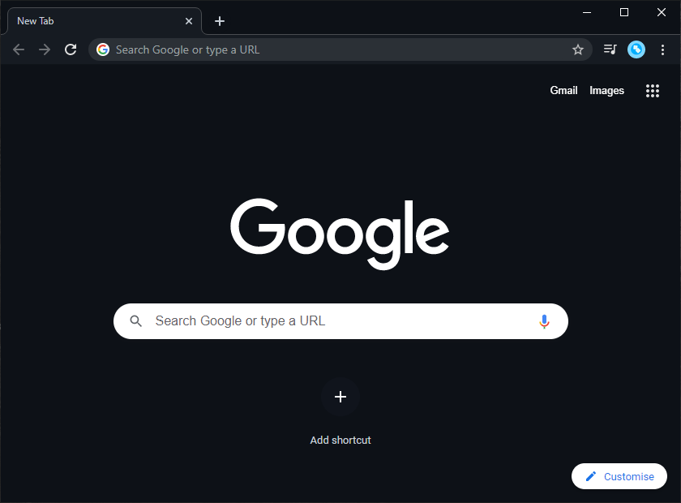

# GitHub Dark Theme for Chrome

Unofficial theme for Google Chrome using GitHub dark mode colours

### Installation:

Install via [Chrome Store](https://chrome.google.com/webstore/detail/github-dark-theme/hjijpoppdakichlibbhdhbjahaiifdke)

or 

Developer Mode in Chrome

1. Clone this repo
2. Via the 3 dot menu, go to **more tools>extensions**
3. Enable the **Developer Mode** using the toggle
4. Press the **Load unpacked** button
5. Using the folder dialog, select the **src** folder from the checked out code
6. The theme should be automatically applied

### Sample:

## License

[MIT](https://choosealicense.com/licenses/mit/)

## Acknowledgments

Store Icon uses [Ionicons](https://github.com/ionic-team/ionicons)